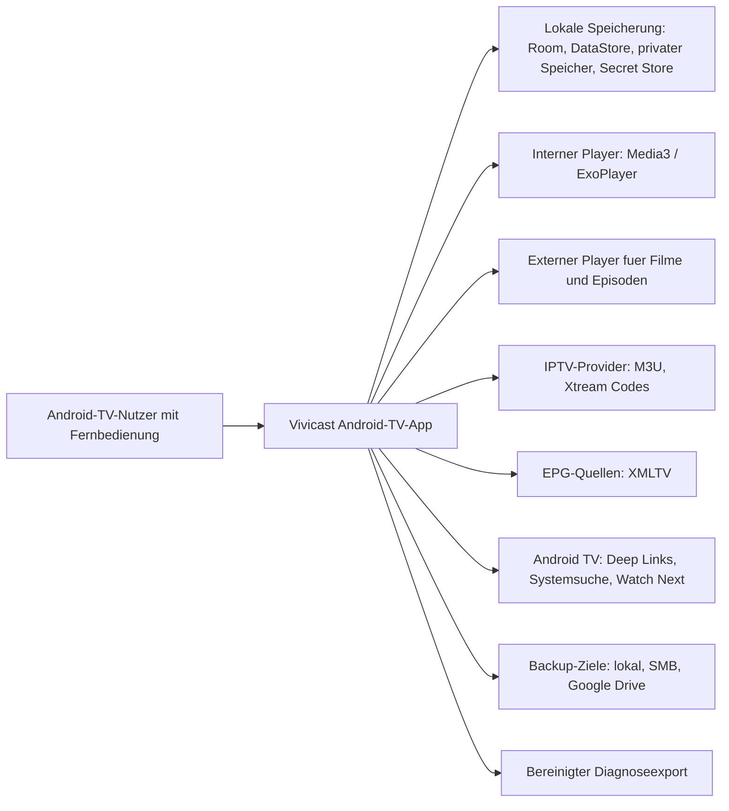

# 01 - System Context

Status: Onboarding-Referenz v1

## Rolle

Dieses Diagramm ist eine Onboarding- und Architekturhilfe. Es fuehrt keine neuen Produkt-, Architektur- oder Datenregeln ein.

Bei Widerspruechen gewinnen PRD, ADRs und `DOCS-GOVERNANCE.md`.

## Quellen

- `prd/PRD-v1/01-product-overview.md`
- `prd/PRD-v1/08-android-tv-security.md`
- `architecture/decisions/ADR-001-provider-isolation.md`
- `architecture/decisions/ADR-004-backup-strategy.md`
- `architecture/decisions/ADR-008-android-tv-integration.md`
- `architecture/decisions/ADR-014-security-data-network-backup.md`

## Diagramm

## Hinweise

- Provider bleiben isoliert.
- Standard-Backups enthalten keine geheimen Zugangswerte.
- Geschuetzte Inhalte werden nicht in Android-TV-Systemsuche oder Watch Next veroeffentlicht, solange der Schutz aktiv ist.
- Diagnoseexporte sind bereinigt und export-only.
