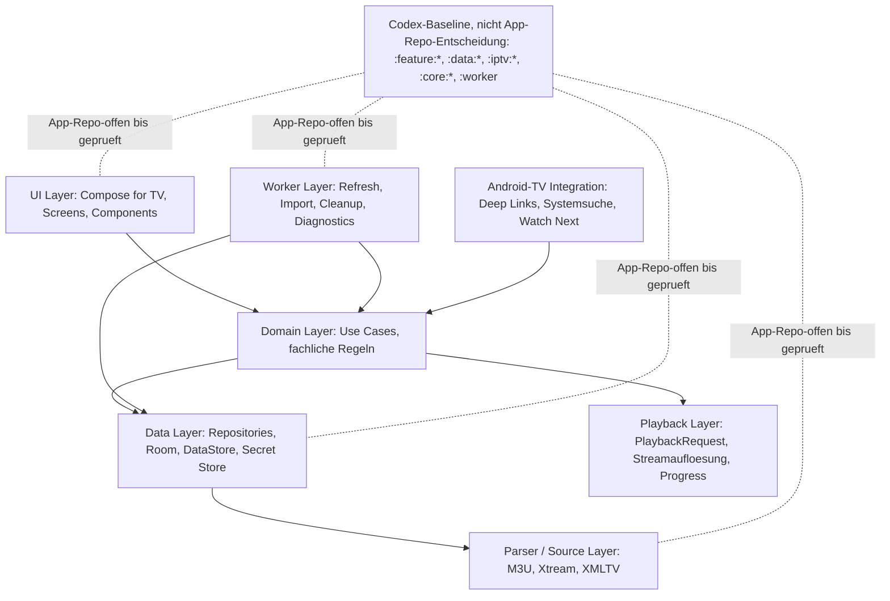

# 02 - Module and Layer Dependencies

Status: Onboarding-Referenz v1

## Rolle

Dieses Diagramm visualisiert nur bereits dokumentierte ADR- und Codex-Arbeitsregeln.

Es ist keine verbindliche App-Modulentscheidung. Die konkrete Gradle- und Modulstruktur bleibt im App-Repository zu pruefen und als App-Repo-Entscheidung zu dokumentieren.

Bei Widerspruechen gewinnen PRD, ADRs, `DOCS-GOVERNANCE.md` und dokumentierte App-Repo-Entscheidungen.

## Quellen

- `DOCS-GOVERNANCE.md`
- `codex/coding-rules.md`
- `architecture/decisions/ADR-001-provider-isolation.md`
- `architecture/decisions/ADR-010-stable-identities-and-restore-keys.md`
- `architecture/decisions/ADR-011-parser-source-contracts.md`
- `architecture/decisions/ADR-012-atomic-import-refresh.md`

## Diagramm

## Hinweise

- Keine UI-Komponente greift direkt auf die Datenbank zu.
- Repository Pattern, Use Cases und Unidirectional Data Flow sind Codex-Arbeitsbaseline.
- Neue oder abweichende verbindliche Architekturentscheidungen muessen als ADR oder App-Repo-Entscheidung dokumentiert werden.
