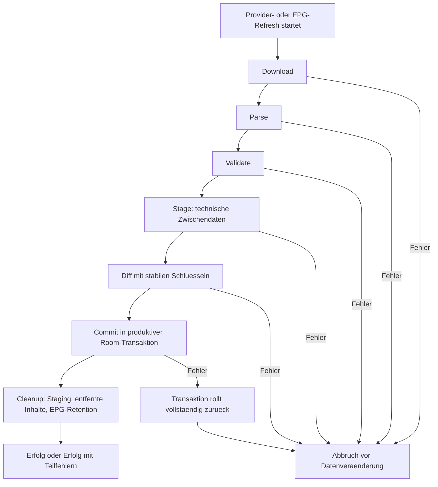

# 03 - Import and Refresh Flow

Status: Onboarding-Referenz v1

## Rolle

Dieses Diagramm visualisiert den atomaren Import- und Refresh-Vertrag. Es fuehrt keine neuen Commit-, Rollback- oder Loeschregeln ein.

Bei Widerspruechen gewinnen PRD, ADRs und `DOCS-GOVERNANCE.md`.

## Quellen

- `prd/PRD-v1/07-background-jobs-performance.md`
- `prd/PRD-v1/12-parser-source-contracts.md`
- `architecture/decisions/ADR-011-parser-source-contracts.md`
- `architecture/decisions/ADR-012-atomic-import-refresh.md`

## Diagramm

## Hinweise

- Vor `Commit` werden keine produktiven Daten veraendert.
- Toleranter Teilimport darf valide Eintraege committen, aber destruktive Loeschungen nur fuer autoritativ gelesene Teilbereiche ausfuehren.
- Fehlgeschlagene oder nicht autoritative Refreshes duerfen vorhandene Inhalte und pending Restore-Referenzen nicht loeschen.
