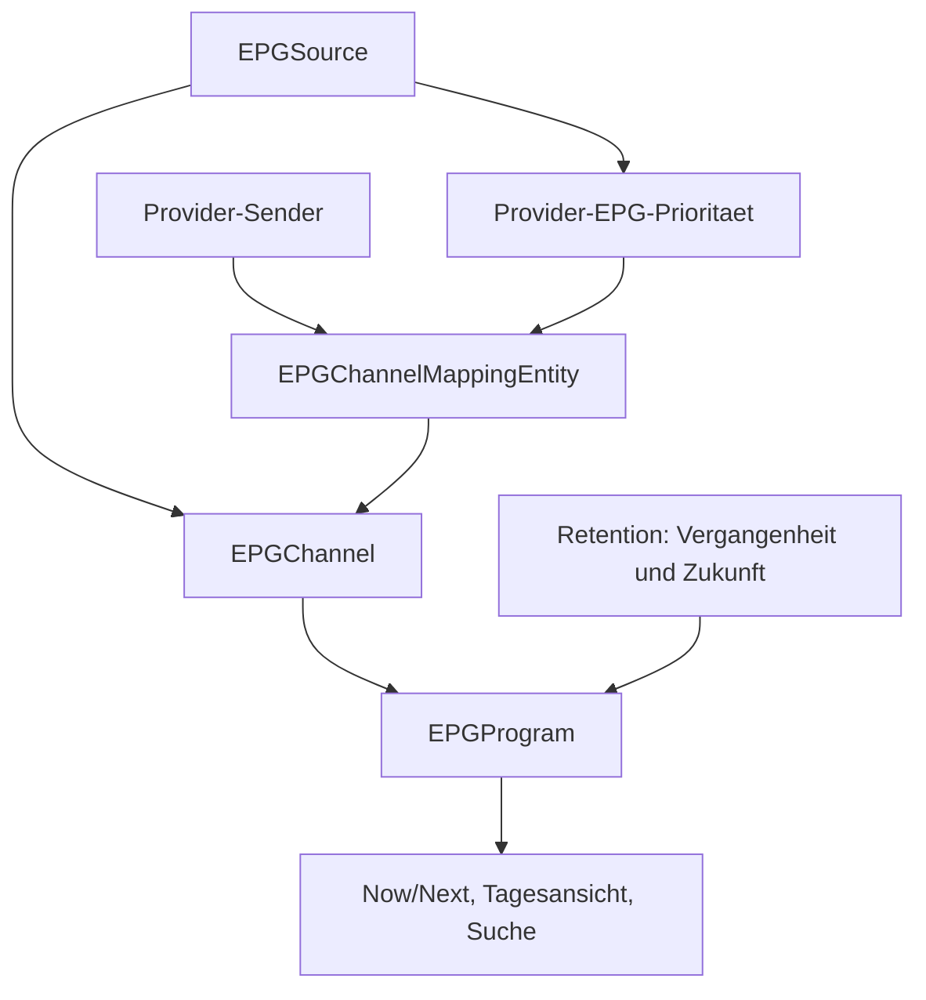

# 04 - EPG Flow

Status: Onboarding-Referenz v1

## Rolle

Dieses Diagramm visualisiert die dokumentierte EPG-Pipeline und Retention. Es ersetzt keine PRD- oder ADR-Regel.

Bei Widerspruechen gewinnen PRD, ADRs und `DOCS-GOVERNANCE.md`.

## Quellen

- `prd/PRD-v1/05-iptv-epg-favorites.md`
- `prd/PRD-v1/06-data-model.md`
- `prd/PRD-v1/12-parser-source-contracts.md`
- `architecture/decisions/ADR-002-epg-strategy.md`
- `architecture/decisions/ADR-003-refresh-strategy.md`

## Diagramm

## Hinweise

- EPG-Daten werden quellbezogen gespeichert.
- Provider-Sender erhalten EPG-Programme ueber Mapping und Prioritaet, nicht ueber providerbezogene Programmkopien.
- Retention loescht nur EPG-Programmdaten ausserhalb des konfigurierten Fensters.
- EPG-Quellen, EPG-Kanäle, Provider-Zuordnungen und manuelle Mappings bleiben beim Cleanup erhalten.
