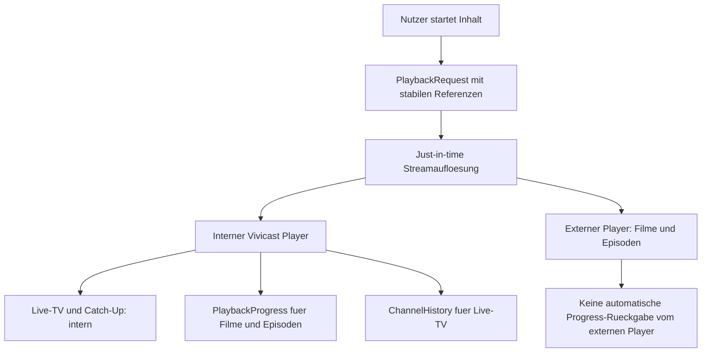

# 05 - Player and Progress Flow

Status: Onboarding-Referenz v1

## Rolle

Dieses Diagramm visualisiert den dokumentierten Player-, PlaybackRequest- und Progress-Vertrag. Es fuehrt keine neuen Playerregeln ein.

Bei Widerspruechen gewinnen PRD, ADRs und `DOCS-GOVERNANCE.md`.

## Quellen

- `prd/PRD-v1/02-live-tv-requirements.md`
- `prd/PRD-v1/03-movies-series-requirements.md`
- `prd/PRD-v1/04-search-settings-player-requirements.md`
- `prd/PRD-v1/06-data-model.md`
- `architecture/decisions/ADR-006-timeshift-strategy.md`
- `architecture/decisions/ADR-013-player-playback-progress.md`

## Diagramm

## Hinweise

- Stream-URLs sind Laufzeitdaten und werden nicht dauerhaft gespeichert oder geloggt.
- Der globale User-Agent wird zentral durch Netzwerk- beziehungsweise Streamaufloesung angewendet.
- Der PlaybackRequest enthaelt keine provider-spezifischen Header-, Cookie- oder User-Agent-Konzepte.
- Live-TV und Catch-Up erzeugen keinen PlaybackProgress-Datensatz.
