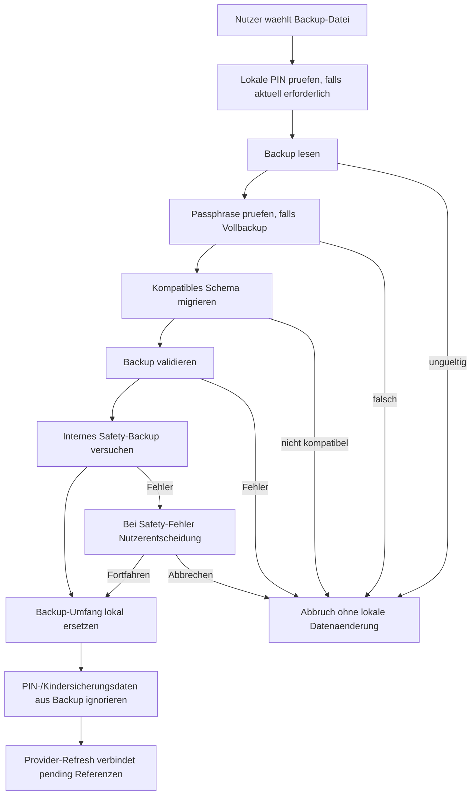

# 06 - Backup and Restore Flow

Status: Onboarding-Referenz v1

## Rolle

Dieses Diagramm visualisiert den dokumentierten Backup- und Restore-Vertrag. Es fuehrt keine neuen Backup-, Restore- oder Sicherheitsregeln ein.

Bei Widerspruechen gewinnen PRD, ADRs und `DOCS-GOVERNANCE.md`.

## Quellen

- `prd/PRD-v1/10-backup-import-requirements.md`
- `prd/PRD-v1/06-data-model.md`
- `architecture/decisions/ADR-004-backup-strategy.md`
- `architecture/decisions/ADR-010-stable-identities-and-restore-keys.md`
- `architecture/decisions/ADR-014-security-data-network-backup.md`

## Diagramm

## Hinweise

- Restore ist in v1 Ersetzen, kein Merge.
- Standard-Backups exportieren keine geheimen Zugangswerte.
- Vollbackups duerfen geheime Zugangswerte nur passphrasegeschuetzt wiederherstellen.
- PIN-Pruefwerte, aktive PIN-Freigaben und Kindersicherung-Schutzflags werden nie aus dem Backup uebernommen.
